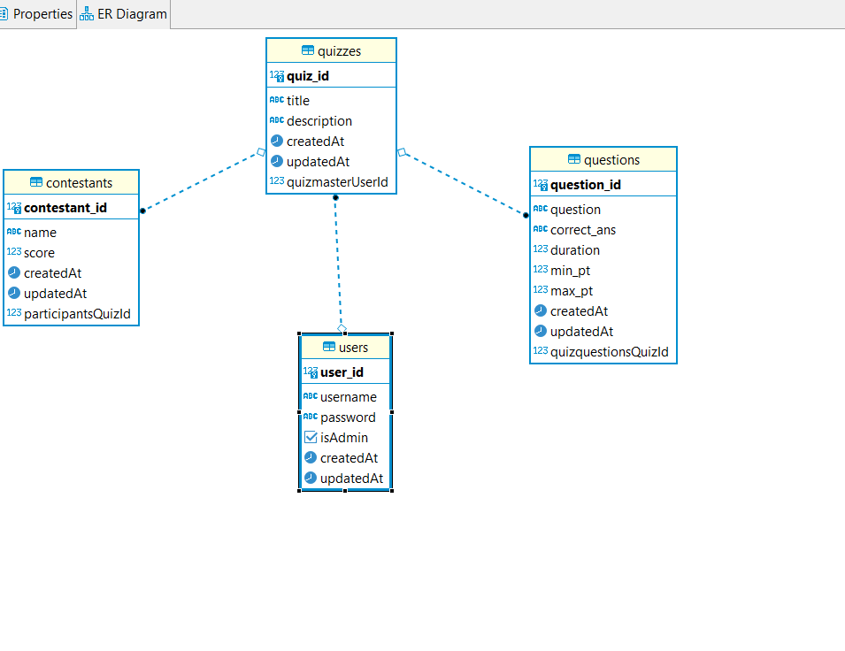

# QUIZMASTER DATABASE
The scripts for database creation for my QUIZMASTER APP was generated with pgAdmin4

    This copy was made by creating a backup of the database. To get a local copy, you have to restore this file.

  

